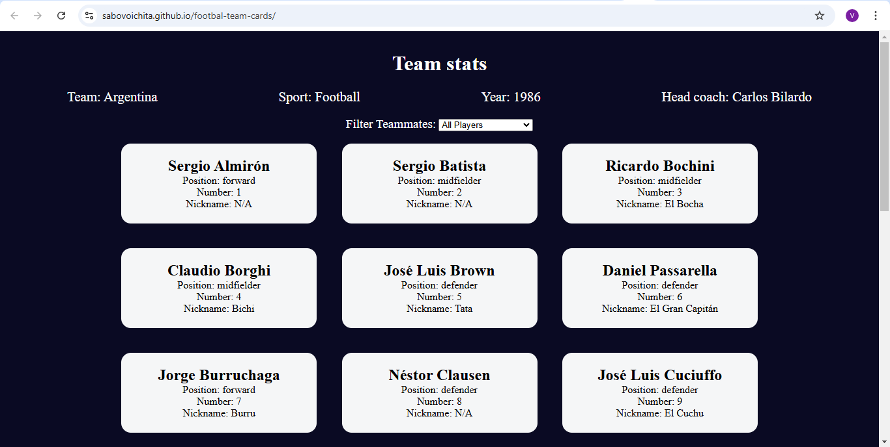

# Footbal Team Cards

This project will cover concepts like, default parameters, Object.freeze(), and reinforce your knowledge of the switch statement and map() method.

One common aspect of building web applications: processing datasets, and then outputting information to the screen. In this sports team cards project, you'll learn how to work with DOM manipulation, object destructuring, event handling, and data filtering.

[link](https://sabovoichita.github.io/footbal-team-cards/)

